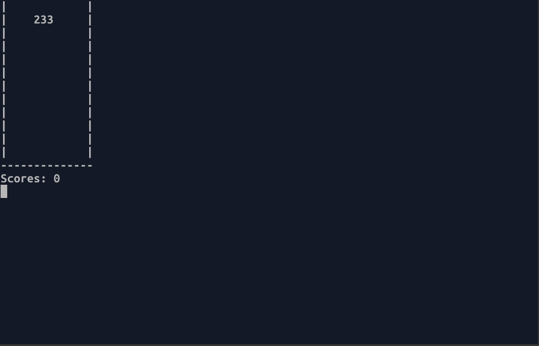
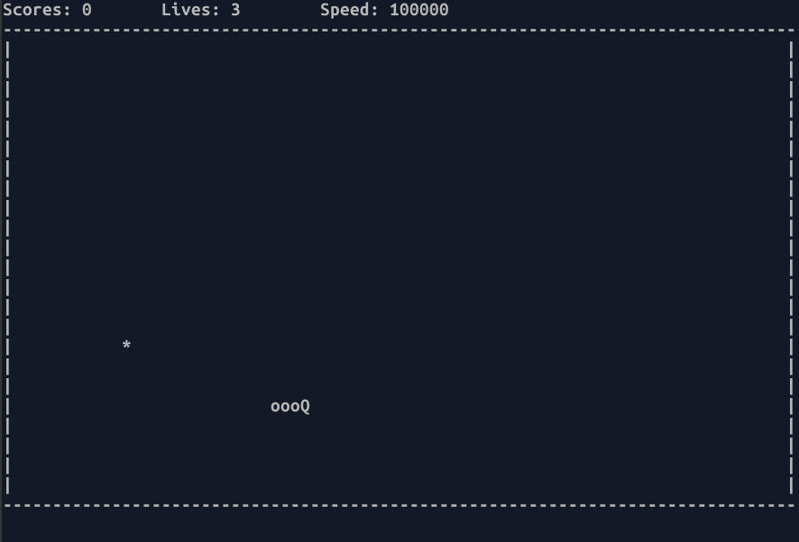
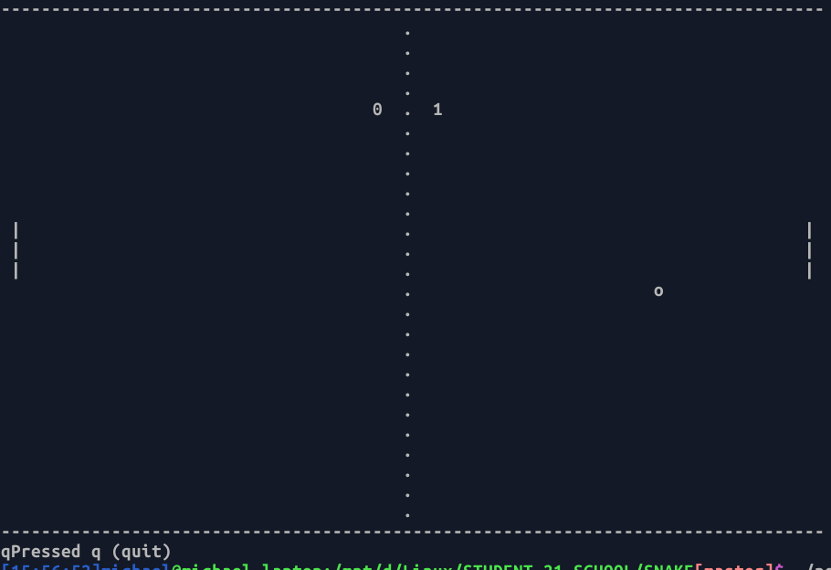
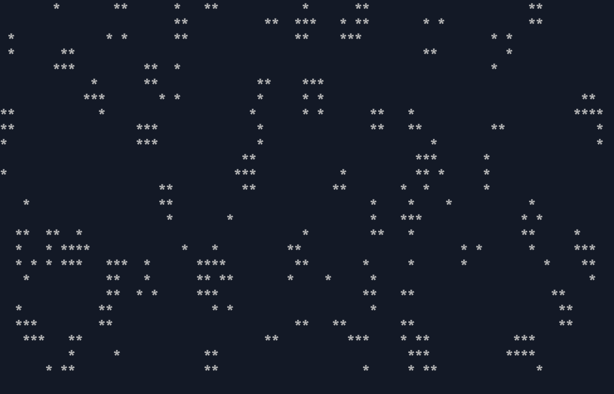

# C-Games 
###### (Games written on C)
Main rules:
1) Only standard libraries
2) Only ASCII symbols
3) Code-style and no-leaks
---
### **Match-3**
> A tile-matching video game is a type of puzzle video game where the player manipulates tiles in order to make them disappear according to a matching criterion. In many tile-matching games, that criterion is to place a given number of tiles of the same type so that they adjoin each other. That number is often three, and these games are called match-three games.

###### Compilation:
>**make match_three**

###### Execute:
>**./match_three**
---

###  **Snake**
> **Snake** is a video game genre where the player maneuvers a growing line that becomes a primary obstacle to itself. The concept originated in the 1976 two-player arcade game Blockade from Gremlin Industries, and the ease of implementation has led to hundreds of versions (some of which have the word snake or worm in the title) for many platforms. 1982's Tron arcade game, based on the film, includes snake gameplay for the single-player Light Cycles segment. After a variant was preloaded on Nokia mobile phones in 1998, there was a resurgence of interest in snake games as it found a larger audience.

###### Compilation:

>**make snake**

###### Execute:
>**./snake**
---
###  **Pong** is a 1972 video game created by video game pioneer Al Alcorn.
> **Pong** is a table tennis–themed twitch arcade sports video game, featuring simple two-dimensional graphics, manufactured by Atari and originally released in 1972. It was one of the earliest arcade video games; it was created by Allan Alcorn as a training exercise assigned to him by Atari co-founder Nolan Bushnell, but Bushnell and Atari co-founder Ted Dabney were surprised by the quality of Alcorn's work and decided to manufacture the game. Bushnell based the game's concept on an electronic ping-pong game included in the Magnavox Odyssey, the first home video game console. In response, Magnavox later sued Atari for patent infringement.

###### Compilation:

>**make pong**
###### Execute:
>**./pong**
---
###  **Game of Life** (Conway's Game of Life)
> The Game of Life, also known simply as Life, is a cellular automaton devised by the British mathematician John Horton Conway in 1970. It is a zero-player game, meaning that its evolution is determined by its initial state, requiring no further input. One interacts with the Game of Life by creating an initial configuration and observing how it evolves. It is Turing complete and can simulate a universal constructor or any other Turing machine.

###### Compilation:

>**make game_of_life**
###### Execute:
>**./game_of_life**

###### To be continued...