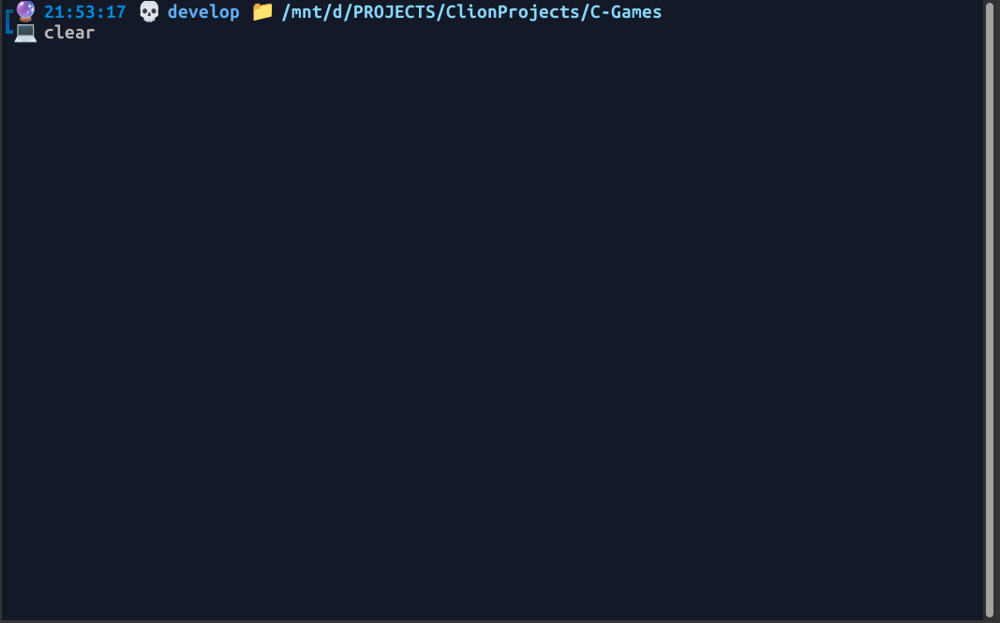
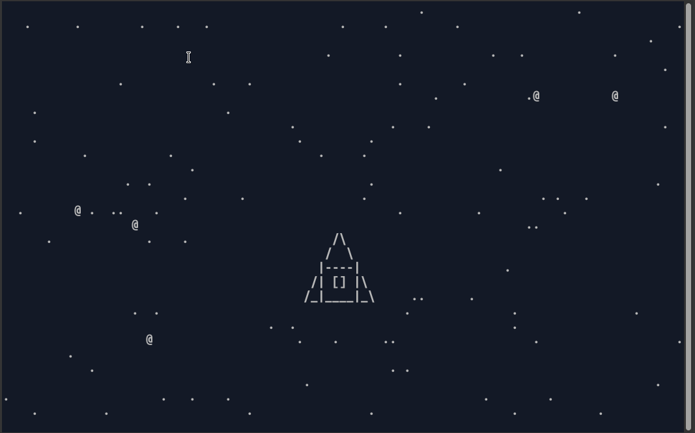

# C-Games projects
### Games written on C
Main rules:
1) Only standard libraries (no ncurses)
2) Only ASCII symbols
3) Code-style and no-leaks
---
### **Classic Tetris (1984)**

> Tetris is one of the most iconic and influential video games ever created. Developed in 1984 by Russian software engineer Alexey Pajitnov, its simple yet captivating gameplay turned it into a global phenomenon. This project is an approximation of the original Tetris experience, faithfully implemented in C to capture the timeless essence of the classic game.



###### Compile and execute:
```bash
make tetris
```

---
### **ASCII Starfighter**
> ASCII Starfighter is a retro terminal window game inspired by classics of the genre such as Spacewar! (1962), Space Invaders (1978) and Asteroids (1979). In this game, you control a cute spaceship made in ASCII art, dodge falling meteorites and destroy them with shots. Simple controls and dynamic graphics create the atmosphere of a real space battle, returning you to the era of the birth of computer games.



###### Compile and execute:
```bash
make stars
```
---
### **Match-3**
> A tile-matching video game is a type of puzzle video game where the player manipulates tiles in order to make them disappear according to a matching criterion. In many tile-matching games, that criterion is to place a given number of tiles of the same type so that they adjoin each other. That number is often three, and these games are called match-three games.


###### Compile and execute:
```bash
make match_three
```
---

###  **Snake**
> **Snake** is a video game genre where the player maneuvers a growing line that becomes a primary obstacle to itself. The concept originated in the 1976 two-player arcade game Blockade from Gremlin Industries, and the ease of implementation has led to hundreds of versions (some of which have the word snake or worm in the title) for many platforms. 1982's Tron arcade game, based on the film, includes snake gameplay for the single-player Light Cycles segment. After a variant was preloaded on Nokia mobile phones in 1998, there was a resurgence of interest in snake games as it found a larger audience.


###### Compile and execute:
```bash
make snake
```
---
###  **Pong** is a 1972 video game created by video game pioneer Al Alcorn.
> **Pong** is a table tennis–themed twitch arcade sports video game, featuring simple two-dimensional graphics, manufactured by Atari and originally released in 1972. It was one of the earliest arcade video games; it was created by Allan Alcorn as a training exercise assigned to him by Atari co-founder Nolan Bushnell, but Bushnell and Atari co-founder Ted Dabney were surprised by the quality of Alcorn's work and decided to manufacture the game. Bushnell based the game's concept on an electronic ping-pong game included in the Magnavox Odyssey, the first home video game console. In response, Magnavox later sued Atari for patent infringement.


###### Compile and execute:
```bash
make pong
```
---
###  **Game of Life** (Conway's Game of Life)
> The Game of Life, also known simply as Life, is a cellular automaton devised by the British mathematician John Horton Conway in 1970. It is a zero-player game, meaning that its evolution is determined by its initial state, requiring no further input. One interacts with the Game of Life by creating an initial configuration and observing how it evolves. It is Turing complete and can simulate a universal constructor or any other Turing machine.


###### Compile and execute:
```bash
make game_of_life
```

###### <sup>To be continued...</sup>